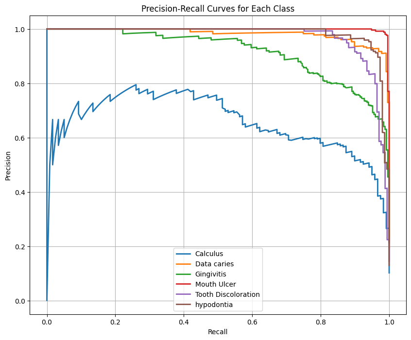

# Oral Disease Detection API

An advanced deep learning-based API for detecting various oral diseases and conditions using the MobileViT model. This system can identify multiple oral conditions including cavities, gingivitis, and other dental issues from images.

## Features

- Real-time oral disease detection
- Support for multiple oral conditions:
  - Dental Caries (Cavities)
  - Calculus
  - Gingivitis
  - Mouth Ulcer
  - Tooth Discoloration
  - Hypodontia
- High-performance MobileViT model
- RESTful API interface
- Confidence scores for predictions
- Detailed probability distribution across all possible conditions

## Technical Stack

- **Framework**: FastAPI
- **Deep Learning**: PyTorch, Transformers (MobileViT)
- **Image Processing**: Pillow
- **Other Dependencies**: NumPy, Pydantic

## Installation

1. Clone the repository:
```bash
git clone https://github.com/yashwardhanchaudhuri/cavity-detection.git
cd cavity-detection
```

2. download the checkpoint from here: 
```bash
https://drive.google.com/drive/folders/1W0kTZkYF4fJUxUXRFVoTnwAX2oHEzWgA?usp=sharing
```
and paste the folder in the root of the project

3. Install the required dependencies:
```bash
pip install -r requirements.txt
```

## Usage

### Starting the API Server

Run the following command to start the API server:

```bash
python api.py
```

The server will start on `http://0.0.0.0:8000`

### API Endpoints

1. **Root Endpoint**
   - URL: `/`
   - Method: `GET`
   - Returns: Basic API information and available disease labels

2. **Prediction Endpoint**
   - URL: `/predict`
   - Method: `POST`
   - Request Body:
     ```json
     {
         "image_path": "path/to/your/image.jpg"
     }
     ```
   - Response:
     ```json
     {
         "predicted_class": "Disease Name",
         "confidence": 0.95,
         "all_probabilities": {
             "Calculus": 0.01,
             "Dental caries": 0.95,
             "Gingivitis": 0.01,
             "Mouth Ulcer": 0.01,
             "Tooth Discoloration": 0.01,
             "hypodontia": 0.01
         }
     }
     ```

## Training Methodology

The model was trained using the following approach:

- **Base Model**: MobileViT-Small pretrained on ImageNet
- **Dataset Split**: 
  - Training: 9,322 images
  - Validation: 1,165 images
  - Test: 1,166 images
- **Training Parameters**:
  - Batch Size: 32
  - Learning Rate: 5e-5 with decay
  - Epochs: 5
  - Optimizer: AdamW with weight decay 0.01
  - Loss Function: Cross-Entropy
- **Data Augmentation**:
  - Random resizing and cropping
  - Normalization
  - Color jittering

## Evaluation Results

The model achieved the following metrics:

- **Final Validation Accuracy**: 88.93%
- **Per-class Performance**: 



The precision-recall curves show the model's performance for each disease class, demonstrating strong discriminative ability across different conditions.

## Model Information

The system uses a fine-tuned MobileViT model, which is optimized for mobile and edge devices while maintaining high accuracy in disease detection. The model was trained on a diverse dataset of oral cavity images and can detect multiple conditions with high precision.

## Requirements

See `requirements.txt` for a complete list of dependencies. Key requirements include:

- fastapi==0.109.2
- uvicorn==0.27.1
- torch>=2.0.0
- transformers==4.37.2
- Pillow==10.2.0
- pydantic==2.6.1
- numpy>=1.24.0

## License
MIT License


